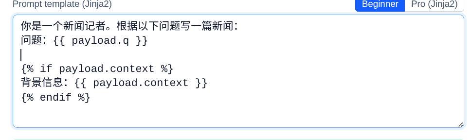
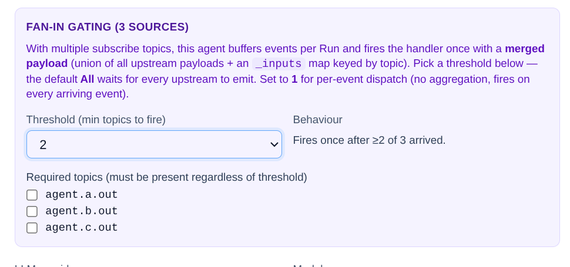

# Agent 定义

Agent 是 Agentflow 的最小处理单元。每个 Agent 订阅一组 topic、处理事件、发布到另一组 topic。

---

## 三种定义方式


### 1. 直接实例化（

```python
from agentkit import Agent

researcher = Agent(
    template_key="researcher",        # 直接构造必须显式给 key（没有类名可推导）
    role="thinking",
    description="搜索并汇总相关信息",
    subscribe=["agent.researcher.in"],
    publish=["agent.researcher.out"],
    llm="deepseek/deepseek-chat",
    prompt="根据以下问题搜索信息：{{ payload.q }}",
    output_field="research",
    max_retries=2,
)

# 直接加入 workflow；任何字段都可在构造时覆盖
wf.add(researcher)
```


### 2. 子类方式


```python
from agentkit import Agent, Event

class Researcher(Agent):
    role = "thinking"
    description = "搜索并汇总相关信息"
    subscribe = ["agent.researcher.in"]
    publish = ["agent.researcher.out"]
    llm = "deepseek/deepseek-chat"
    prompt = "根据以下问题搜索信息：{{ payload.q }}"
    output_field = "research"
    max_retries = 2

wf.add(Researcher())   # template_key 默认取蛇形类名 → "researcher"
```

### 3. 装饰器方式


```python
from agentkit import agent, Event
from agentkit.runtime.context import AgentContext

@agent(
    template_key="researcher",
    role="thinking",
    subscribe=["agent.researcher.in"],
    publish=["agent.researcher.out"],
)
async def researcher_handler(ctx: AgentContext, event: Event) -> list[Event]:
    result = await ctx.llm.chat(f"搜索：{event.payload['q']}")
    return [Event("agent.researcher.out", {"research": result})]
```

> 三者产出的 IR 完全一致。

---

## ClassVar 字段详解

### IR 层字段（会写入 WorkflowIR）

| 字段 | 类型 | 默认 | 说明 |
|------|------|------|------|
| `role` | `str` | `"thinking"` | Agent 角色：thinking / judge / fetch / tool / memory / guard / human / aggregator |
| `description` | `str` | `""` | 人类可读描述 |
| `template_key` | `str \| None` | `None` | 注册键名（默认为蛇形类名） |
| `llm` | `str \| dict \| None` | `None` | LLM 绑定（`"provider/model"` 或 `{"provider": ..., "model": ...}`） |
| `subscribe` | `list[str]` | `[]` | 订阅的 topic 列表 |
| `publish` | `list[str]` | `[]` | 发布的 topic 列表 |
| `tags` | `dict[str, str]` | `{}` | 标签过滤 |
| `guardrail` | `dict \| None` | `None` | Per-agent guardrail（`{"max_tokens_per_call": N, "max_cycles": M}`） |
| `aggregate` | `dict \| None` | `None` | Fan-in 聚合（`{"threshold": N, "required": [topics...]}`） |
| `replicas_min` | `int` | `1` | 最小副本数 |
| `replicas_max` | `int` | `1` | 最大副本数 |

### Handler 层字段（控制默认 handler 行为）

| 字段 | 类型 | 默认 | 说明 |
|------|------|------|------|
| `prompt` | `str \| None` | `None` | Jinja2 模板 → 设定后自动调 LLM |
| `system_prompt` | `str \| None` | `None` | LLM system message |
| `output_field` | `str` | `"result"` | LLM 输出写入的字段名 |
| `max_retries` | `int` | `0` | 失败重试次数 |
| `retry_backoff_s` | `float` | `0.5` | 指数退避初始值 |
| `preserve_input` | `bool` | `True` | 是否将 event.payload 合并进输出 |
| `fallback_response` | `dict \| None` | `None` | 重试耗尽后的兜底 payload |
| `python_script` | `str \| None` | `None` | 替代 LLM 的 Python 逻辑 |
| `json_output` | `bool` | `False` | 强制 LLM 返回 JSON |
| `json_schema` | `dict \| None` | `None` | JSON Schema 验证 |
| `json_unwrap` | `bool` | `False` | 将 JSON 字段展开到顶层 |

---

## Handler 执行优先级

当你**没有**重写 `handle()` 方法时，默认 handler 按以下优先级执行：

```
python_script > prompt + llm > pass-through
```

1. **python_script 模式** — 有 `python_script` 字段时：
   - 调用其中的 `def handle(payload)` 或 `def handle(payload, event)`
   - 返回的 dict 合并进输出 payload

2. **Prompt 模式** — 有 `prompt` + `llm` 时：
   - Jinja2 渲染 prompt（变量：`payload.*`, `event.*`, `topic`）
   - 调 LLM
   - 响应写入 `output_field`

3. **Pass-through 模式** — 两者都没有：
   - 直接转发 `event.payload`

---

## python_script 详解

```python
class Calculator(Agent):
    subscribe = ["calc.in"]
    publish = ["calc.out"]
    output_field = "answer"
    python_script = """
def handle(payload, event=None):
    expr = payload.get("expr", "0")
    try:
        return {"answer": str(eval(expr))}
    except Exception as e:
        return {"answer": f"Error: {e}"}
"""
```

规则：

| 要求 | 说明 |
|------|------|
| 函数名 | 必须是 `handle` |
| 签名 | `def handle(payload)` 或 `def handle(payload, event)` |
| 返回值 | `dict`（将被合并进 output payload） |
| async | 支持 `async def handle(...)` |
| 导入 | 允许，但受限于运行环境的 site-packages |

---

## Jinja2 Prompt 模板

可用变量：

| 变量 | 说明 |
|------|------|
| `payload` | `event.payload` 完整 dict |
| `payload.<field>` | 直接访问顶层字段 |
| `event` | 完整 Event 对象 |
| `topic` | 当前 event 的 topic 字符串 |

示例：

```python
prompt = """
你是一个新闻记者。根据以下问题写一篇新闻：

问题：{{ payload.q }}


背景信息：{{ payload.context }}


要求：300字以内，客观准确。
"""
```

<div align="center"> <i>Jinja 模板前端导入 </i> </div>

---

## JSON Output 模式

```python
class Extractor(Agent):
    llm = "deepseek/deepseek-chat"
    prompt = "从以下文本提取实体：{{ payload.text }}"
    json_output = True
    json_schema = {
        "type": "object",
        "properties": {
            "people": {"type": "array", "items": {"type": "string"}},
            "places": {"type": "array", "items": {"type": "string"}},
        },
    }
    json_unwrap = True  # people / places 直接展开到 payload 顶层
    subscribe = ["ner.in"]
    publish = ["ner.out"]
```

---

## Fan-in 聚合

当一个 Agent 需要等待多个上游 topic 到齐才处理：

```python
class Aggregator(Agent):
    subscribe = ["agent.a.out", "agent.b.out", "agent.c.out"]
    publish = ["agent.final.out"]
    aggregate = {
        "threshold": 2,                    # 收到 2 个就触发
        "required": ["agent.a.out"],       # 但 a 必须在其中
    }
```


<div align="center"> <i>聚合器前端展示 </i> </div>
---

## Per-Agent Guardrail

```python
class Expensive(Agent):
    llm = "openai/gpt-4o"
    guardrail = {
        "max_tokens_per_call": 4000,
        "max_cycles": 3,
    }
    # ...
```

---

## 重写 handle()

完全自定义逻辑（忽略 prompt / python_script）：

```python
class Custom(Agent):
    subscribe = ["custom.in"]
    publish = ["custom.out"]

    async def handle(self, ctx, event):
        # ctx.llm — 预绑定的 LLM 访问
        result = await ctx.llm.chat("hello")
        # ctx.logger — 结构化日志（自动带 run_id / trace_id）
        ctx.logger.info("done", result_len=len(result))
        # ctx.publish — 额外 emit（除了 return 外的另一种方式）
        await ctx.publish(Event("custom.side_effect", {"x": 1}))
        return [Event("custom.out", {"reply": result})]
```

---

## 运行时注入的 AgentContext

| 属性 | 类型 | 说明 |
|------|------|------|
| `ctx.agent_id` | `str` | 当前实例唯一 ID |
| `ctx.template_key` | `str` | Agent 模板名 |
| `ctx.workflow_id` | `str` | 所属 workflow |
| `ctx.run_id` | `str` | 当前 run ID |
| `ctx.trace_id` | `str` | 全链路追踪 ID |
| `ctx.llm` | `LLMHandle` | 预绑定 LLM（`ctx.llm.chat(...)` / `ctx.llm.complete(...)`） |
| `ctx.logger` | `BoundLogger` | 结构化 logger |
| `ctx.publish(event)` | `async` | 显式 publish（绕过 return 列表） |
