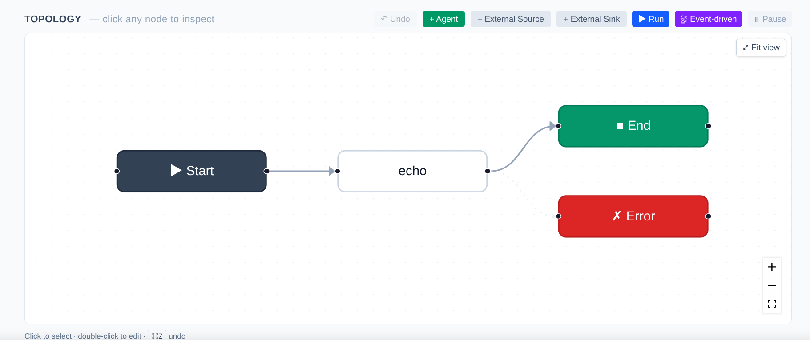

# Quick Start

## Installation

```bash
cd agentflow
pip install -e ".[dev]"

```

## Hello World — Local Single Agent

```python
from agentkit import Agent, workflow, START, END, Event
from agentkit.testing import LocalRuntime

class Echo(Agent):
    """Return the input as-is."""
    role = "thinking"
    subscribe = ["agent.echo.in"]
    publish = ["agent.echo.out"]

    async def handle(self, ctx, event):
        return [Event("agent.echo.out", {"text": event.payload.get("q", "")})]

# Build workflow
wf = workflow("wf_hello")
echo = Echo()
wf.add(echo)
wf.connect(START, echo)
wf.connect(echo, END)

# Run locally
import asyncio

async def main():
    async with LocalRuntime(wf) as rt:
        run = await rt.run(input={"q": "Hello Agentflow"})
        print(f"Status: {run.status}")  # Succeeded
        # Get the last envelope
        last = [e for e in rt.bus.published if not e.topic.startswith("system.")][-1]
        print(f"Output: {last.payload}")

asyncio.run(main())

```

Output:

```text
Status: Succeeded
Output: {'text': 'Hello Agentflow'}

```


<div align="center"> <i>Echo Agent workflow in UI </i> </div>

---

## Using LLM Prompts

Instead of overriding `handle()`, you can use a declarative prompt:

```python
class Tagger(Agent):
    role = "thinking"
    subscribe = ["agent.tagger.in"]
    publish = ["agent.tagger.out"]
    llm = "deepseek/deepseek-chat"
    prompt = "Perform sentiment analysis (positive/negative/neutral) on the following news: {{ payload.text }}"
    output_field = "sentiment"
    max_retries = 2
    fallback_response = {"sentiment": "unknown"}

async def main():
    NEWS = (
        "Residents in Singapore can now remit money to WeChat Pay via DBS Remit. "
        "Citizens, permanent residents, and foreigners residing in Singapore can now "
        "use DBS Remit via the DBS digibank app to transfer money to the Chinese e-wallet "
        "WeChat Pay with zero transaction fees."
    )
    wf_tag = workflow("wf_tagger")
    tag = Tagger()
    wf_tag.add(tag).connect(START, tag).connect(tag, END)

    if HAS_DEEPSEEK_KEY:
        api_key = (os.environ.get("DEEPSEEK_API_KEY") or
                os.environ.get("AGENTKIT_LLM_DEEPSEEK_API_KEY"))
        llm_arg = build_llm_gateway(
            instances=[
                LLMInstanceConfig(
                    name="deepseek",
                    adapter="openai",
                    compat="deepseek",
                    api_key=api_key,
                    base_url="https://api.deepseek.com/v1",
                )
            ],
            default_provider="deepseek",
            default_model="deepseek-chat",
        )
        print("\n✅ Using real DeepSeek API")
    else:
        llm_arg = MockLLMGateway(reply="positive")
        print("\n⚠ DEEPSEEK_API_KEY not detected, falling back to MockLLM")

    async with LocalRuntime(wf_tag, llm=llm_arg) as rt:
        run = await rt.run(input={"text": NEWS}, timeout=60)

```

When both `prompt` and `llm` are configured, the default handler automatically:

1. Renders the Jinja2 template (can reference `payload.*` / `event.*`).
2. Calls the LLM.
3. Writes the response to `output_field`.
4. Publishes the event to `publish[0]`.

---

## Using python_script Mode

Don't want to rely on an LLM or write class methods? Use `python_script`:

```python
class Scorer(Agent):
    subscribe = ["agent.scorer.in"]
    publish = ["agent.scorer.out"]
    output_field = "score"
    python_script = """
def handle(payload):
    text = payload.get("text", "")
    return {"score": len(text) / 100}
"""

```

**Rules:**

* Must define `def handle(payload)` or `def handle(payload, event)`.
* Must return a `dict` (which will be merged into the output payload).
* Supports `async def`.

---

## Running via CLI

```bash
# Initialize project
agentkit init my_project

# Validate YAML
agentkit validate workflows/wf_hello.yaml

# Execute locally (using Mock LLM)
agentkit run workflows/wf_hello.yaml \
  --input '{"q": "hello"}' \
  --handlers handlers \
  --timeout 10

# Start Web UI + API server
agentkit serve --port 8080 --workflows workflows/

```

---

## Deploying to a Remote Server

```python
from agentkit import AgentKitClient

async with AgentKitClient("http://localhost:8080") as c:
    await c.deploy(wf)
    run = await c.create_run("wf_hello", input={"q": "ping"})
    print(run)

```

For more details, see the [Control Plane Client](https://www.google.com/search?q=client.md).

---

## Next Steps

* Dive into [Agent Definition](agent.md) to understand all available fields.
* Learn [Workflow Construction](https://www.google.com/search?q=workflow.md) to master multi-agent graph orchestration.
* Integrate [External I/O](https://www.google.com/search?q=external-io.md) to connect with Telegram / Email.